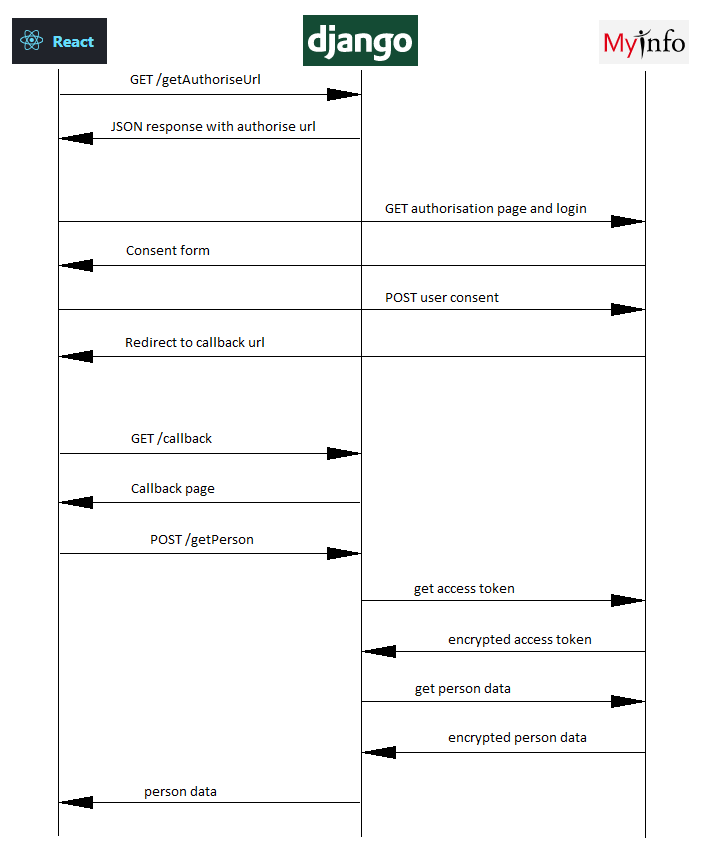
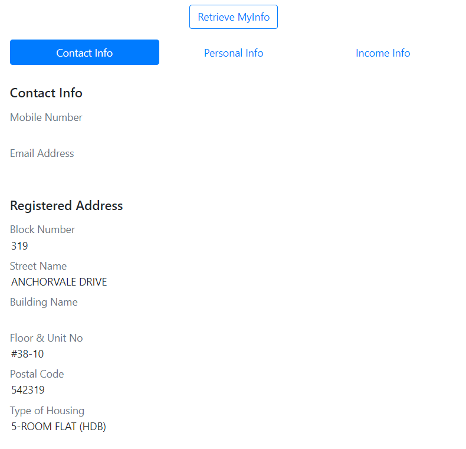
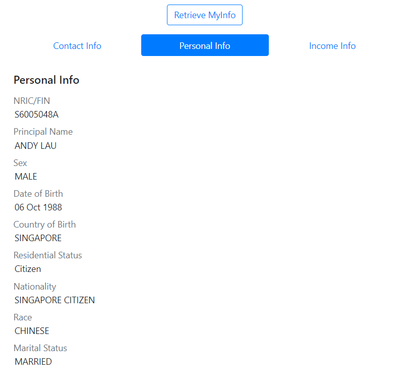
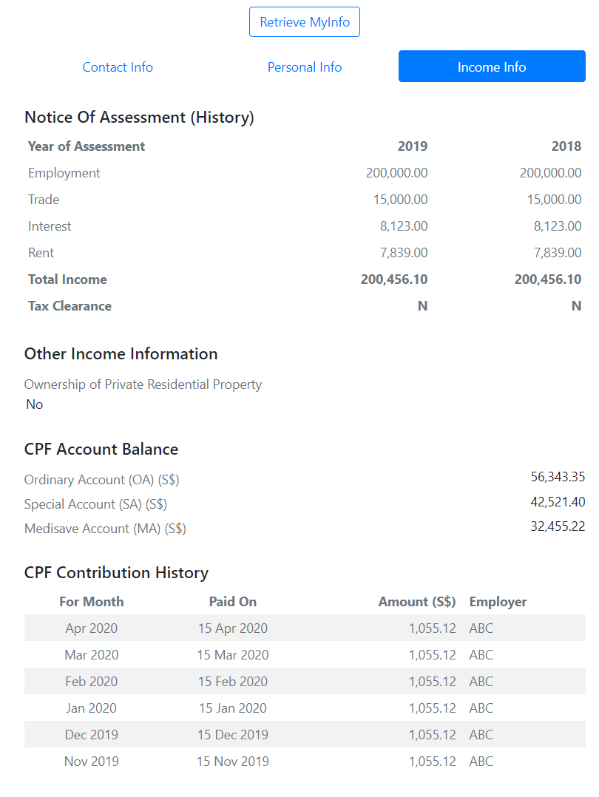

# ablr_coding_challenge

## Overview

Use the existing code provided (or roll your own as you see fit), build a **Django-backend** application with
**React frontend** to demonstrate the integration with MyInfo APIs, similar to the Demo app provided by 
Singapore Government Technology Agency (GovTech): https://github.com/ndi-trusted-data/myinfo-demo-app

## Sequence Diagram



## How to Run

Install all the required modules:

```
pip install -r requirements
```

Run migration (mainly to setup the session table):

```
python manage.py migrate
```

Run Django development server on port 3001:

```
python manage.py runserver localhost:3001
```

Open your favourite web browser and go to:

```
http://localhost:3001
```

## Sample Screenshots





## Getting ChromeDriver

I'm using Selenium + ChromeDriver for end-to-end testing. ChromeDriver for Windows for Chrome version 83 is included in 'chromedriver' folder. Other version of ChromeDriver can be found [here](https://chromedriver.chromium.org/downloads)

When using different ChromeDriver, please update 'chromedriver_path' in [apps/myinfo/tests.py](./apps/myinfo/tests.py) accordingly:

```python
# Test end-to-end
class MyInfoViewSeleniumTestCase(StaticLiveServerTestCase):
    port = 3001
    
    @classmethod
    def setUpClass(cls):
        super().setUpClass()
        
        chromedriver_path = 'chromedriver/chromedriver_83.exe'
        chrome_options = webdriver.ChromeOptions()
        # comment out next line if you want to see chrome window
        chrome_options.add_argument('--headless')
        cls.webdriver = webdriver.Chrome(chromedriver_path, options=chrome_options)
```

## Running Test Cases

Run test cases:

```
coverage run manage.py test
```

You might see the following exception at the end:

```
.----------------------------------------
Exception happened during processing of request from ('127.0.0.1', 62866)
Traceback (most recent call last):
  File "D:\apps\python\Lib\socketserver.py", line 650, in process_request_thread
    self.finish_request(request, client_address)
  File "D:\apps\python\Lib\socketserver.py", line 360, in finish_request
    self.RequestHandlerClass(request, client_address, self)
  File "D:\apps\python\Lib\socketserver.py", line 720, in __init__
    self.handle()
  File "d:\projects\upwork\jason_mah\env\lib\site-packages\django\core\servers\basehttp.py", line 174, in handle
    self.handle_one_request()
  File "d:\projects\upwork\jason_mah\env\lib\site-packages\django\core\servers\basehttp.py", line 182, in handle_one_request
    self.raw_requestline = self.rfile.readline(65537)
  File "D:\apps\python\Lib\socket.py", line 669, in readinto
    return self._sock.recv_into(b)
ConnectionResetError: [WinError 10054] An existing connection was forcibly closed by the remote host
----------------------------------------

----------------------------------------------------------------------
Ran 11 tests in 27.227s

OK
Destroying test database for alias 'default'...
```

I think that happens when we're trying to close the chromedriver at the end of the test. I still don't know how to get rid of this error.

Coverage report:

```
coverage report --include="apps/myinfo*"
Name                                 Stmts   Miss  Cover
--------------------------------------------------------
apps\myinfo\__init__.py                  0      0   100%
apps\myinfo\client.py                   47      0   100%
apps\myinfo\migrations\__init__.py       0      0   100%
apps\myinfo\models.py                    1      0   100%
apps\myinfo\security.py                 42      0   100%
apps\myinfo\settings.py                  9      0   100%
apps\myinfo\tests.py                   102      1    99%
apps\myinfo\urls.py                      3      0   100%
apps\myinfo\views.py                    55      0   100%
--------------------------------------------------------
TOTAL                                  259      1    99%
```
